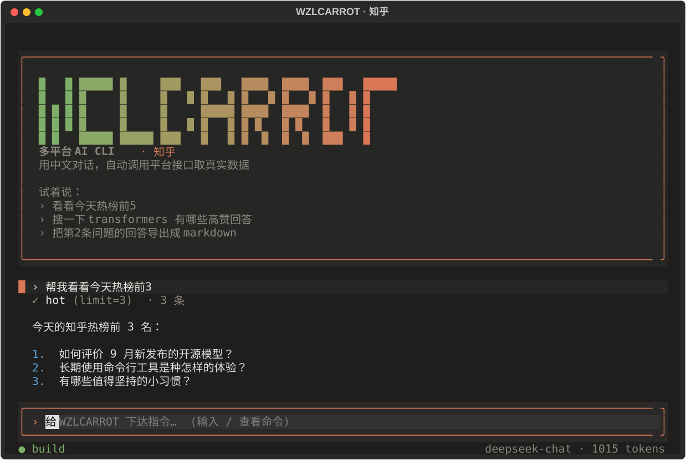

# wzlcarrot-cli

多平台命令行客户端（当前内置 **知乎**）。**所有命令都要求登录**，请求默认限速 1–3 秒，适合个人低频使用。

> ⚠️ 免责声明：知乎没有公开 API，本工具通过逆向前端接口实现，可能违反其用户协议。仅供个人学习与归档，请勿高频抓取或公开分发。写操作（点赞/评论/发布）可能导致账号受限，风险自负。

## 特性

- 纯 Python 实现 `x-zse-96` v2 签名，无需浏览器
- 登录凭证本地保存（`chmod 600`、加密），支持 Cookie 导入与纯 API 登录链接/扫码
- 读：热榜 / 推荐流 / 话题 / 搜索 / 问题 / 回答 / 文章 / 评论 / 用户 / 关注 / 粉丝 / 收藏夹 / 通知
- 写：赞同·反对·取消 / 关注用户或问题 / 收藏 / 评论 / 发布回答
- 创作：发布提问 / 想法 / 专栏文章（支持 HTML 富文本与图片上传），删除自己的内容
- 导出 Markdown（回答、文章、问题及答案），可加 `--images` 把图片本地归档、目录自包含
- 全局限速 + 写操作单独更长间隔 + 自动重试 + 分页
- 对话上下文自动压缩（旧工具结果截断 + 超阈值 LLM 摘要，支持 `/compact`）
- 插件可贡献 CLI 命令、Agent 工具、系统提示词段，以及工具管线钩子（`api.hook`）
- 守卫式工具管线：pre/post 钩子可拒绝/询问/改写参数/注解结果；支持声明式规则文件
- 系统提示词分段组装（基础段 + 记忆 + 插件段）；记忆来自 `~/.config/zhihu-cli/AGENTS.md` 与当前目录 `ZHIHU.md`，`wzlcarrot prompt` 可预览
- 超大工具结果自动落盘（私有 0600 文件），模型可用 `read_spill` 分段回读，不再被截断丢失
- 环境自检 `wzlcarrot doctor`：登录/模型/插件/钩子/溢出/会话/连通性一屏看清
- 多步任务：`todo_write` 工具 + TUI 实时任务面板 + `/todos` 查看
- 真实 token 用量统计（非流式/流式都采集 provider usage），TUI 状态栏显示、`/stats` 查看
- 对话会话本地保存，支持 `--continue` 续聊、`wzlcarrot sessions` 查看
- 自然语言 Agent（`zhihu` / `wzlcarrot ask`）由 LLM 调用以上能力

## TUI 一览



*截图由 `uv run python scripts/screenshot.py` 自动生成（无需登录）。*

## 安装

从 PyPI（发行包名 `wzlcarrot-cli`，命令仍是 `zhihu`）：

```bash
uv tool install wzlcarrot-cli
# 或 pip install wzlcarrot-cli
```

一键安装脚本（自动选 uv / pipx / pip）：

```bash
curl -fsSL https://raw.githubusercontent.com/your-org/wzlcarrot-cli/main/scripts/install.sh | bash
```

或下载**单文件二进制**（无需 Python），见 `packaging/` 与 `.github/workflows/binaries.yml`：

从源码：

```bash
cd ~/zhihu-cli
uv sync                 # 或： pip install -e .
```

安装后命令为 `zhihu`（也可 `uv run zhihu`）。想在任意目录直接用 `zhihu`，做一次全局安装：

```bash
uv tool install --editable ~/zhihu-cli
```

之后直接运行 `wzlcarrot` 即进入全屏 TUI。

## 多平台 CLI（`wzlcarrot`）

顶层命令是 **`wzlcarrot`**，命令分两类：

**通用（跨平台）——挂在 `wzlcarrot` 下：**

```bash
wzlcarrot connect      # 配置模型供应商与 API Key
wzlcarrot doctor       # 自检
wzlcarrot tui          # 对话 TUI
wzlcarrot chat / ask   # 文本对话
wzlcarrot sessions / plugins / hooks / spill / prompt / upgrade / version
```

**通用（跨平台）——`wzlcarrot`：**

```bash
wzlcarrot connect      # 配置模型供应商与 API Key
wzlcarrot doctor       # 自检
wzlcarrot platforms    # 列出已注册平台
wzlcarrot tui          # 对话 TUI
wzlcarrot chat / ask   # 文本对话
wzlcarrot sessions / plugins / hooks / spill / prompt / upgrade / version
```

**平台特定——各自的命令（当前只有知乎，命令是 `zhihu`）：**

```bash
zhihu hot              # 知乎热榜
zhihu search 关键词
zhihu login            # 登录链接
zhihu comment --answer <id> -m "..."
```

> 平台命令**不带 `wzlcarrot` 前缀**：`zhihu ...` 就是知乎入口。后续会以同样方式加入 `weibo`、`xiaohongshu` 等平台（每个平台一个独立命令，共享同一套核心）。

## 升级与版本检查

- 每天首次使用时检查一次 PyPI 是否有新版本：仅查询 PyPI 公开的版本信息，
  **无任何遥测**；发现新版会在命令前提示一行。设置 `ZHIHU_CLI_NO_UPDATE_CHECK=1`
  可关闭检查。
- `wzlcarrot upgrade`：自动识别安装方式（uv tool / pipx / pip）并执行对应的升级命令；
  源码（editable）安装时提示用 `git pull && uv sync` 升级。

## 登录

**最省事：直接复用你 Edge 里的登录态**（不用再登录，但需先完全关闭 Edge）：

```bash
zhihu login --edge
```

它用你**真实的 Edge 配置**以调试模式启动，Edge 自己解密 Cookie，CLI 通过 DevTools 协议读取——因此能拿到你已登录的 `z_c0`。

**或：打开一个真实浏览器登录**（不跳手机端、不影响你的 Edge）：

```bash
zhihu login --browser     # 需先装可选依赖：pip install 'wzlcarrot-cli[browser]'
```

其他方式：

```bash
zhihu login               # 打印登录链接（在已登录知乎的浏览器打开确认）
zhihu login --qr          # 在终端显示二维码
zhihu login --cookie "d_c0=...; z_c0=...; _xsrf=..."   # 手动粘贴 Cookie
```

> 说明：现代化的 Edge/Chrome 用应用绑定加密（app-bound），**离线或复制配置都读不到登录态**；`--edge` 是唯一能复用现有登录的方式，代价是要先关闭 Edge。

手动 Cookie 获取：登录 `https://www.zhihu.com` → DevTools → Network → 任意请求 → Request Headers → 复制整行 `Cookie`。

```bash
zhihu status
zhihu logout
wzlcarrot doctor       # 自检：登录、模型、插件、钩子、溢出、会话、连通性
```

## 凭据存储与安全

- 登录凭证以 **Fernet 加密**后保存在 `~/.config/zhihu-cli/credentials.json`，权限 `600`；
  加密密钥存于同级 `.credentials.key`（权限 `600`）。保存与每次读取时都会自动收紧权限。
  旧版的明文凭证文件可被自动读取，并在下次保存时升级为加密格式。
- 关于风险水位：加密密钥也在本机，因此其保护强度与"浏览器保存的 Cookie"相近——
  能读你 home 目录的攻击者两者都防不住。请勿在不可信或多用户的机器上使用；
  担心落盘可 `zhihu logout` 及时清除，或不保存。
- 本工具**不含任何遥测或数据上报**。全部网络请求只有两类：知乎 API，
  以及你自己配置的 LLM API 端点（`wzlcarrot connect` / `llm.json`）。

## 用法

```bash
zhihu hot -n 20
zhihu feed -n 10
zhihu topic 19550517 -q
zhihu search 开源 大模型 -n 10
zhihu question 123456 -a -n 5
zhihu answer 12345678 -c -n 10
zhihu article 12345678 -c
zhihu comments --answer 12345678
zhihu user someone
zhihu me
zhihu following
zhihu followers
zhihu collections
zhihu notifications -n 10

# 导出
zhihu download answer 12345678 -o ./downloads
zhihu download question 123456 -n 10
zhihu download article 12345678 --comments
zhihu download article 12345678 --images     # 图片下载到本地并改写为相对路径

# 写操作（默认二次确认，加 -y 跳过）
zhihu action vote --answer 12345678
zhihu action unvote --answer 12345678
zhihu action collect 12345678 -c 123456
zhihu action uncollect 12345678 -c 123456
zhihu action follow --user someone
zhihu action follow --question 123456
zhihu action comment --answer 12345678 -m "说得对"
zhihu action delete-comment 11575408549
zhihu action publish 123456 -f answer.html

# 创作（支持 HTML 富文本与图片，-i 可重复）
zhihu publish ask "如何学习 Python？" -d "请详细解释" -t 19550517
zhihu publish pin "今天天气真好" -c "正文" -i photo.jpg
zhihu publish article "标题" "<p>正文</p>" -i cover.png
zhihu publish delete-question 12345678 -y
zhihu publish delete-pin 12345678 -y
zhihu publish delete-article 12345678 -y
```

全局选项放在子命令之前：

```bash
zhihu --min-delay 2 --max-delay 5 --json hot
zhihu --write-delay 15 action vote --answer 12345678
```

### Markdown 编辑器创作（`--edit`）

给发布类命令加 `--edit`，会用 Markdown 编辑器打开一个临时 `.md` 文件：

- 编辑器解析顺序：`$ZHIHU_CLI_EDITOR` → 自动识别 **Windows 的 MarkText** → `$EDITOR`/`nano`
- WSL 下会自动定位 `MarkText.exe`（读桌面快捷方式），并放到 Windows 临时目录打开，保存后回终端按回车
- 首行 `# 标题` 作为标题，其余为正文
- 正文里的本地图片 `` 会**自动上传**并转成知乎富文本；网络图片原样保留
- 内容留空或没改动则自动取消；提问标题会自动补问号

```bash
zhihu publish article --edit
zhihu publish pin --edit
zhihu publish ask --edit
zhihu action publish 123456 --edit          # 发布回答
zhihu action comment --answer 12345678 --edit   # 评论仅纯文本，图片会被忽略
```

自定义编辑器（模板里用 `{file}`）：

```bash
export ZHIHU_CLI_EDITOR='code {file}'   # VS Code
export ZHIHU_CLI_EDITOR='vim {file}'
```

### 限速（默认已很保守）

本工具刻意保持**低频访问**，共三层保护：

- 所有请求之间随机间隔 **1.5–3.5 秒**
- 写操作（赞同/关注/评论/发布）最小间隔 **8 秒**（`--write-delay`）
- **跨进程最小间隔 3 秒**：即使你连着敲多条命令，也通过状态文件强制间隔（`--min-gap`）
- 敏感接口（`followers`/`followees`/`notifications`）再额外 +6 秒
- 一旦命中知乎反爬提示，**自动冷却 120 秒**并给出明确报错，避免继续触发

```bash
# 想更慢：把各间隔都调大
zhihu --min-delay 4 --max-delay 8 --min-gap 10 --write-delay 30 hot
```

失败自动退避重试；请勿通过脚本高频调用。

## 自然语言模式

用中文直接描述需求，LLM 会调用上面的命令取真实数据并总结。

全屏 TUI（推荐，类似 Claude Code 的界面）：

```bash
wzlcarrot tui
```

在 TUI 里直接用中文说，例如：

```
看看今天热榜前5
搜一下 transformers，挑 3 个高赞回答
帮我写一条关于今天热榜的想法     ← 自动弹出 MarkText，写完点「完成」即发布
把那篇回答导出成 markdown
```

输入 `/` 会**弹出命令面板**（Tab 补全），可用命令：

| 命令 | 作用 |
|------|------|
| `/connect` | 在 TUI 内选择供应商并填写 API Key，保存即生效 |
| `/model` | 查看当前模型 |
| `/stats` | 本次会话 token 用量与统计 |
| `/todos` | 查看任务清单 |
| `/compact` | 压缩上下文 |
| `/sessions` | 列出已保存会话 |
| `/new` | 开始新会话 |
| `/help` | 显示全部命令 |
| `/clear` | 清屏 |
| `/copy` | 复制上一条回答到剪贴板 |
| `/quit` | 退出 |

复制：鼠标选中文字后按 **Ctrl+C** 复制；`/copy` 复制上一条回答。无选中文字时，**Ctrl+C 连按两下**退出。

左下角显示当前模式：**build**（可读可写） / **plan**（只读规划），按 **Shift+Tab** 切换。plan 模式下所有写操作会被拒绝，Agent 只做只读查询与方案规划。

> 长对话会**自动压缩上下文**：先截断旧的工具结果（不耗模型），超过阈值再把较早内容交给模型摘要成一条 system 消息，仅保留最近的若干轮，避免撑爆上下文。

纯文本模式：

```bash
wzlcarrot ask "帮我看看今天热榜前5"
wzlcarrot chat                 # 进对话，输入 exit 退出
wzlcarrot chat --continue      # 恢复最近一次会话继续聊
wzlcarrot chat --session 20260101-120000
wzlcarrot sessions             # 列出已保存的会话
wzlcarrot chat --yes           # 写操作不再逐次确认
```

会话保存在 `~/.config/zhihu-cli/sessions/`（权限 0600）。

需要配置一个 **OpenAI 兼容**的模型接口。最简单：交互式配置（内置常见供应商）

```bash
wzlcarrot connect              # 选择供应商 → 填 API Key → 选模型
wzlcarrot connect --list       # 查看内置供应商与模型
wzlcarrot connect -p deepseek -k sk-xxx -m deepseek-chat --test
```

内置：DeepSeek、OpenAI、智谱 GLM、月之暗面 Kimi、通义千问、MiniMax、硅基流动、OpenRouter、Agnes，以及自定义（任意 OpenAI 兼容地址）。

也可以手写配置：

```bash
# 环境变量
export ZHIHU_CLI_LLM_API_KEY=sk-xxx
export ZHIHU_CLI_LLM_BASE_URL=https://api.deepseek.com/v1   # 可选
export ZHIHU_CLI_LLM_MODEL=deepseek-chat                    # 可选

# 或配置文件 ~/.config/zhihu-cli/llm.json
{ "api_key": "sk-xxx", "base_url": "https://api.deepseek.com/v1", "model": "deepseek-chat" }

# 或运行时
wzlcarrot ask "热榜前3" --api-key sk-xxx --model deepseek-chat
```

模型必须支持 function calling（工具调用）。写操作在对话中会再次请求确认。

## 插件（Everything is a plugin）

命令与 Agent 工具都由**注册表**贡献，插件即可扩展。发现方式：

1. **入口点**：包暴露 `wzlcarrot_cli.plugins` 组的 `entry_point`（适合分发到 PyPI）。
2. **本地目录**：把 `.py` 丢进 `~/.config/zhihu-cli/plugins/`（即插即用）。

插件就是一个带 `register(api)` 的模块，可以贡献：

```python
# ~/.config/zhihu-cli/plugins/hello.py
import typer

def register(api):
    def hello(name: str = typer.Argument("world")):
        """打个招呼。"""
        typer.echo(f"hello, {name}")
    api.command("hello", hello)          # 新增 CLI 命令

    def echo(client, text: str) -> dict:  # Agent 工具：handler(client, **args)
        return {"echo": text, "length": len(text)}
    api.tool(
        name="echo", description="回显文本",
        parameters={"type": "object",
                    "properties": {"text": {"type": "string"}},
                    "required": ["text"]},
        handler=echo, write=False,
    )

    api.prompt_section("style", "回答保持简短。", priority=10)  # 注入系统提示词段
```

- 查看已加载：`wzlcarrot plugins`
- 单个插件加载失败不会影响其他插件，也不会中断启动
- 禁用全部插件：`ZHIHU_CLI_NO_PLUGINS=1`
- 完整示例见 `examples/plugins/hello.py`

## Hook（守卫式工具管线）

每次工具调用前后都会经过 pre/post 钩子，可实现拦截、询问、改写参数、注解结果。两种来源：

**1. 声明式规则文件** `~/.config/zhihu-cli/hooks.json`（示例见 `examples/hooks.json`）：

```json
{ "hooks": [
  {"event": "pre_execute", "tools": ["delete_content", "delete_comment"],
   "action": "ask", "message": "删除不可逆，请确认"},
  {"event": "pre_execute", "tools": ["vote"], "field": "direction",
   "pattern": "^down$", "action": "deny", "message": "已禁用『反对』"}
] }
```

支持 `action: deny|ask`，`field`+`pattern` 做参数匹配，`tools` 可用通配符 `delete_*`。

**2. 插件钩子**（`api.hook(event, fn, matcher="*")`）：

```python
from wzlcarrot_cli.hooks import POST_EXECUTE, HookResult

def annotate(name, args, result):
    return HookResult(context="（由插件标注）")
api.hook(POST_EXECUTE, annotate, matcher="hot")
```

- `pre_execute` 返回 `HookResult(decision="deny"/"ask", reason=...)` 或 `args={...}` 改写参数
- `post_execute` 返回 `HookResult(result=..., context=...)` 改写/注解结果
- 钩子抛异常会被隔离，不影响管线
- 查看已加载：`wzlcarrot hooks`

## AI Agent Skill

`skill/SKILL.md` 是一份供**其他 Agent**（opencode / Claude Code / OpenClaw 等）读取的技能说明，让它们知道如何调用 `zhihu` 命令。装到 opencode：

```bash
mkdir -p ~/.opencode/skill/zhihu-cli
cp skill/SKILL.md ~/.opencode/skill/zhihu-cli/SKILL.md
```

之后 opencode 会把它作为可用技能加载，Agent 即可代你执行知乎读写。

凭证位置：`~/.config/zhihu-cli/credentials.json`（可用 `ZHIHU_CLI_HOME` 覆盖目录）。

## 开发

```bash
uv sync --extra dev
uv run ruff check .
uv run pytest                      # 单元 + 快照；集成测试默认跳过
uv run pytest -m integration       # 需已登录，跑真实接口
uv run pytest --cov=wzlcarrot_cli --cov-report=term-missing   # 覆盖率（门禁 55%）
UPDATE_SNAPSHOTS=1 uv run pytest tests/test_snapshots.py   # 刷新提示词/工具 schema 快照
```

`tests/snapshots/` 用 keyless 快照固定**模型可见的契约**（基础系统提示词、内置工具 schema），改坏立刻红。

签名算法位于 `wzlcarrot_cli/signing.py`，移植自 `zly2006/zhihu-plus-plus`。若知乎更新反爬导致 403/签名失败，通常只需更新该模块。

## 许可与法律

- 源码许可：[LICENSE](LICENSE)（MIT）
- 使用条款：[EULA.md](EULA.md)
- 隐私政策：[PRIVACY.md](PRIVACY.md)（**数据全在本地、零遥测**）
- 合规声明：[COMPLIANCE.md](COMPLIANCE.md)（PIPL / GDPR）

> 本软件使用第三方平台非官方接口，仅限个人对自有账号数据的浏览与归档；请勿大规模抓取或用于侵权用途。
